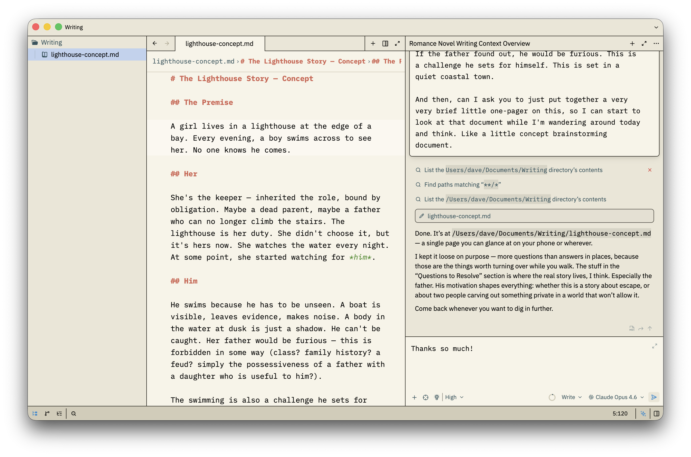

# Aleph Latte

A warm, high-contrast light theme for the [Zed](https://zed.dev) editor with chonky borders and soft blue accents.



## Philosophy

Aleph Latte builds on [Sharp Solarized](https://github.com/leodiegues/sharp-solarized-zed-theme) — a warm sepia palette with bold dark borders and high-contrast readability — and refines it with soft blue accents, cream tabs that don't fight for attention, and colorful but tasteful syntax highlighting.

The result is a theme that feels substantial and grounded (those borders!) without being visually heavy or distracting.

## Design Choices

- **Chonky borders** (`#232018`) — nearly black, giving structure and weight to the UI
- **Warm solarized backgrounds** — cream editor (`#f7f4e8`), warm panels (`#ebe6d6`)
- **Blue accents** (`#288bd1`) — for focus rings, highlights, selections, and search matches
- **Tabs that behave** — active tab lifts to the editor surface color, no jarring dark/inverted tabs
- **Green italic strings** — easy on the eyes, distinct from the rest of the syntax
- **Bold keywords** — blue and weighty, providing landmarks in your code or prose
- **Muted punctuation** — brackets and delimiters fade into the background where they belong

## Installation

### From config directory

Copy the theme file into your Zed (or Aleph) themes directory:

```sh
# For Zed
cp themes/aleph-latte.json ~/.config/zed/themes/

# For Aleph
cp themes/aleph-latte.json ~/.config/aleph/themes/
```

Then set it in your settings:

```json
{
  "theme": "Aleph Latte"
}
```

### As a Zed extension

*Coming soon.*

## Color Palette

| Role | Color | Hex |
|------|-------|-----|
| Editor background |  | `#f7f4e8` |
| Panel background |  | `#ebe6d6` |
| Chrome background |  | `#d2ccb8` |
| Border |  | `#232018` |
| Accent (blue) |  | `#288bd1` |
| Strings (green) |  | `#448C27` |
| Keywords (blue) |  | `#4B69C6` |
| Functions (red) |  | `#AA3731` |
| Constants (amber) |  | `#9C5D27` |
| Variables (purple) |  | `#7A3E9D` |

## Credits

Inspired by [Sharp Solarized](https://github.com/leodiegues/sharp-solarized-zed-theme) by Leo Diegues (based on [tinytinytinytiny](https://github.com/tinytinytinytiny/solarized-high-contrast-light) and [Josh Spicer](https://github.com/joshspicer/sharp-solarized))

## License

MIT
